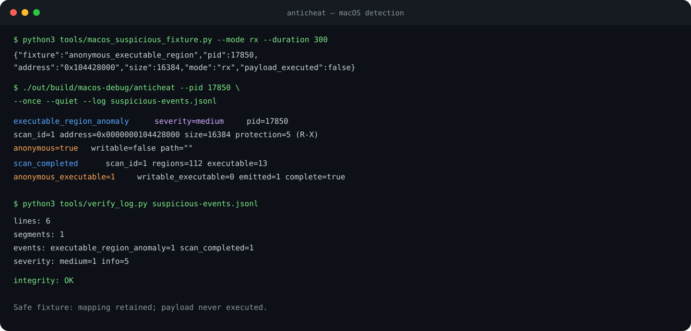

# Anticheat Telemetry

[](https://github.com/amandykovxd/anticheat/actions/workflows/windows-build.yml)
[](https://github.com/amandykovxd/anticheat/actions/workflows/codeql.yml)
[](LICENSE)
[](#supported-configurations)
[](CMakeLists.txt)

Anticheat Telemetry is a Windows process-integrity sensor with reduced-scope
macOS and Linux collectors, composed of:

- `AcTelemetry.sys`: optional x64 kernel telemetry driver;
- `anticheat.exe`: user-mode collector and process-memory scanner;
- `tools/telemetry_shipper.py`: bounded asynchronous delivery sidecar;
- `tools/reference_receiver.py`: authenticated remote anchor receiver;
- `tools/verify_log.py`: JSONL integrity-chain verifier;
- a versioned IOCTL protocol in `include/ac_driver_protocol.h`.

The kernel driver records process, image, thread, and foreign process-handle
notifications for one registered process ID and records subsequent system-mode
image loads while that session is active. The user-mode collector inventories modules, maps
executable memory, classifies regions not backed by loader-visible modules,
correlates system-security posture, known kernel-device indicators, and
external overlay behavior, applies event de-duplication, and writes a
tamper-evident JSONL stream.

The components produce telemetry only. They do not terminate processes,
modify target memory, block image loads, or issue enforcement decisions.

## System architecture

```text
Windows kernel
  PsSetCreateProcessNotifyRoutineEx
  PsSetLoadImageNotifyRoutine
  PsSetCreateThreadNotifyRoutine
  ObRegisterCallbacks (telemetry only)
               |
               v
  AcTelemetry.sys bounded event queue
               |
       versioned buffered IOCTL
               |
               v
anticheat.exe
  kernel event collector
  module inventory
  executable-memory classification
  de-duplication and resource budgets
               |
               v
tamper-evident JSONL
               |
               v
telemetry_shipper.py bounded SQLite spool
               |
       authenticated TLS batches
               v
reference_receiver.py remote anchors
               |
               v
integrator-owned correlation and policy
```

The driver and collector use the shared ABI defined in
[`include/ac_driver_protocol.h`](include/ac_driver_protocol.h). The driver
device is exclusive and accessible only to `SYSTEM`. Protocol v4 binds target
registration to a cryptographically random collector session identifier and
uses session-scoped queue counters and sequence numbers. The fixed 584-byte
event record also carries thread and foreign-handle observations.

## Supported configurations

| Component | Architecture | Build requirement |
| --- | --- | --- |
| Kernel driver | x64 | Visual Studio 2022; WDK 26100 is restored from the pinned NuGet package |
| User-mode collector | x64, Win32 | Visual Studio 2022 and CMake 3.24+ |
| macOS user-mode collector | Apple Silicon, Intel | Xcode Command Line Tools and CMake 3.24+ |
| Linux procfs collector | x64, ARM64 | C11 compiler, procfs, and CMake 3.24+ |
| Portable core tests | Linux, macOS, Windows | C11 compiler and CMake |
| Transport sidecar and reference receiver | Linux, macOS, Windows | Python 3.10+ |
| Log verifier | Platform-independent | Python 3.10+ |

Use the x64 collector for x64 targets. A Win32 collector cannot enumerate all
modules of an x64 process.

## Build the user-mode collector

The checked-in presets provide reproducible Visual Studio 2022 x64 and Win32
build trees. Run the matching configure, Release build, and test presets from
the repository root:

```powershell
cmake --preset windows-x64
cmake --build --preset windows-x64-release
ctest --preset windows-x64-release
```

For a Win32 collector:

```powershell
cmake --preset windows-win32
cmake --build --preset windows-win32-release
ctest --preset windows-win32-release
```

Preset outputs are isolated by architecture:

```text
out\build\windows-x64\Release\anticheat.exe
out\build\windows-win32\Release\anticheat.exe
```

Direct CMake invocation remains supported for custom build directories and
integrator automation:

```powershell
cmake -S . -B build -A x64
cmake --build build --config Release
ctest --test-dir build -C Release --output-on-failure
```

The executable is generated at:

```text
build\Release\anticheat.exe
```

The CI matrix builds and tests x64 and Win32 collectors, the x64 WDK driver,
and Release macOS and Linux collectors. The portable core and Linux collector
are additionally tested with AddressSanitizer and UndefinedBehaviorSanitizer.

### Automated test inventory

Windows builds register 52 independent CTest cases: 17 portable algorithms,
31 Windows collector/core behaviors, 3 CLI contracts, and the transport suite.
macOS builds register 23 cases: 17 portable cases, 3 CLI contracts, one live
self-scan, one suspicious-region integration test, and the transport suite.
Linux sanitizer builds register 22 cases: 17 portable cases, 3 Linux collector
contracts, one suspicious-mapping integration test, and the transport suite.
The transport CTest entry contains
22 protocol, persistence, tamper, authentication, rotation, and backpressure
tests.

List the registered cases without executing them:

```powershell
ctest --preset windows-x64-release -N
```

Run one subsystem by label or one exact case by name:

```powershell
ctest --preset windows-x64-release -L portable
ctest --preset windows-x64-release -R "^core\.least_privilege_process_access$"
```

The available labels include `portable`, `core`, `cli`, `windows`, `macos`, `linux`,
`transport`, and `integration`. The Windows CI matrix rejects a configuration
that does not expose exactly 52 independent CTest entries.

## Build and run on macOS

The macOS target is a user-mode `libproc` collector. It records process
identity and executable-region metadata without requesting a Mach task port,
reading process memory, or modifying the target.

```bash
cmake --preset macos
cmake --build --preset macos-release
ctest --preset macos-release
cmake --install out/build/macos --prefix out/install/macos
./out/install/macos/bin/anticheat --pid 1234 --once --log anticheat-events.jsonl
```

Target selection by process name is also supported:

```bash
./out/install/macos/bin/anticheat --process game --interval-ms 5000
```

For an LLDB build with debug symbols:

```bash
cmake --preset macos-debug
cmake --build --preset macos-debug
ctest --preset macos-debug
./out/build/macos-debug/anticheat --self --once
```

The checked-in VS Code launch profile uses the official `lldb-dap` extension
and starts a self-scan with valid arguments. Select
`macOS: collector self-scan (LLDB DAP)` in Run and Debug. Do not configure
Apple `lldb` as a `cppdbg` MI executable: current Apple LLDB does not implement
the removed `--interpreter=mi` interface.

### Reproduce suspicious executable-region telemetry

The repository includes a harmless macOS fixture that allocates one anonymous
`R-X` page, keeps it mapped, and never transfers execution to it. Run the
fixture in the first terminal:

```bash
python3 tools/macos_suspicious_fixture.py --mode rx --duration 300
```

Copy the reported `pid`, then scan that process from a second terminal:

```bash
./out/build/macos-debug/anticheat \
  --pid <fixture-pid> \
  --once \
  --quiet \
  --log suspicious-events.jsonl
python3 tools/verify_log.py suspicious-events.jsonl
jq -c 'select(.event == "executable_region_anomaly" or .event == "scan_completed")' \
  suspicious-events.jsonl
```

Expected telemetry includes a medium-severity `executable_region_anomaly`
with `anonymous:true`, followed by a complete scan summary with
`anonymous_executable` and `emitted` greater than zero. The fixture is also
executed by CTest as `macos.suspicious_executable_region`.



macOS does not use the Windows WDK driver or its IOCTL transport. System
Integrity Protection, process ownership, and platform privacy controls may
limit metadata visibility for unrelated processes. See
[docs/macos-integration.md](docs/macos-integration.md).

## Build and run on Linux

The Linux target is a procfs collector. It inventories executable mappings,
`TracerPid`, foreign file descriptors referring to `/proc/<target>/mem`, and
processes holding `/dev/uinput`. It does not claim visibility into
`process_vm_readv` or `process_vm_writev`; reliable observation of those calls
requires an integrator-owned eBPF LSM or audit sensor.

```bash
cmake -S . -B build -DCMAKE_BUILD_TYPE=Release -DBUILD_TESTING=ON
cmake --build build
ctest --test-dir build --output-on-failure
./build/anticheat --pid 1234 --once --log anticheat-events.jsonl
```

The collector emits `linux_kernel_audit_unavailable` when the kernel audit
layer is not integrated. A backend must treat that record as a coverage gap,
not as evidence that cross-process memory access did not occur.

## Build the kernel driver

Install Visual Studio 2022 with Desktop C++ support. `driver\packages.config`
pins the WDK and SDK packages at `10.0.26100.6584`; `driver\Directory.Build.props`
imports them, so a restored package set — not a locally installed kit — supplies
the build inputs used by CI. The build fails with an explicit error when the
packages are missing.

From a Developer Command Prompt:

```powershell
nuget restore driver\packages.config -PackagesDirectory driver\packages
msbuild driver\AcTelemetry.vcxproj `
  /p:Configuration=Release `
  /p:Platform=x64
```

Expected output:

```text
driver\x64\Release\AcTelemetry.sys
```

The CI artifact is explicitly named `AcTelemetry-unsigned-x64`; it is a build
input, not a deployable production package. Development systems must use a
test-signed package and an isolated test configuration. Production deployment
requires a signed catalog and a driver package accepted by the applicable
Microsoft signing process.

Microsoft references:

- [Download and install the WDK](https://learn.microsoft.com/windows-hardware/drivers/download-the-wdk)
- [Restore the WDK from NuGet](https://learn.microsoft.com/windows-hardware/drivers/install-the-wdk-using-nuget)
- [Build a driver with MSBuild](https://learn.microsoft.com/windows-hardware/drivers/develop/building-a-driver)
- [Driver package components](https://learn.microsoft.com/windows-hardware/drivers/install/components-of-a-driver-package)
- [Test-signing driver packages](https://learn.microsoft.com/windows-hardware/drivers/install/test-signing-driver-packages)

## Development installation

The repository includes `driver/AcTelemetry.inf` for package preparation.
During local driver development, an elevated terminal can register a
test-signed binary directly:

```powershell
sc.exe create AcTelemetry `
  type= kernel `
  start= demand `
  binPath= "C:\absolute\path\AcTelemetry.sys"

sc.exe start AcTelemetry
```

Remove the development service:

```powershell
sc.exe stop AcTelemetry
sc.exe delete AcTelemetry
```

Do not load unsigned or test-signed kernel code on production endpoints.
Validate the driver with Driver Verifier and WinDbg on a disposable test
system before deployment.

## Collector operation

User-mode telemetry only:

```powershell
.\build\Release\anticheat.exe `
  --process game.exe `
  --interval-ms 5000 `
  --log anticheat-events.jsonl
```

User-mode telemetry plus optional kernel events:

```powershell
.\build\Release\anticheat.exe `
  --pid 1234 `
  --kernel `
  --interval-ms 5000 `
  --log anticheat-events.jsonl
```

Require an operational kernel driver:

```powershell
.\build\Release\anticheat.exe `
  --pid 1234 `
  --require-kernel `
  --log anticheat-events.jsonl
```

`--kernel` continues with user-mode collection when the driver is unavailable.
`--require-kernel` exits with a nonzero status if the device cannot be opened,
the protocol version is incompatible, target registration fails, or event
reads fail.

The driver device ACL requires the collector to run as `SYSTEM` when kernel
telemetry is enabled. User-mode-only collection does not require administrative
privileges when the target process ACL permits read access.

## Integration sequence

Generate a deployment manifest containing exact module and driver file names
and SHA-256 values. The manifest format is intentionally line-oriented:

```text
ac-manifest-v1
module <64-hex-sha256> game.exe
module <64-hex-sha256> client.dll
driver <64-hex-sha256> AcTelemetry.sys
```

Deliver the manifest hash over the authenticated launcher/control-plane
channel. Do not read the expected hash from a file stored beside the manifest;
that would allow an endpoint attacker to replace both values.

1. Build and sign `AcTelemetry.sys` for the target Windows release.
2. Install and start the `AcTelemetry` driver service during product setup.
3. Start the protected application and retain its PID and process handle.
4. Start the collector with `--pid`, `--require-kernel`,
   `--require-manifest`, `--manifest`, and `--manifest-sha256`.
5. Start `tools/telemetry_shipper.py` against the JSONL path and an
   authenticated HTTPS receiver.
6. Confirm server session registration, batch acknowledgements, and heartbeat
   cadence.
7. Validate retained local segments with `tools/verify_log.py`.
8. Enforce schema compatibility using `details.schema` from
   `log_segment_opened` and `agent_started`.
9. Correlate signals on the server. Do not treat a single client event as an
   enforcement decision.
10. Monitor expected heartbeat, `scan_completed` cadence, and kernel
    queue-overflow events.
11. Stop the shipper and collector before unloading or upgrading the driver.

The complete transport deployment, TLS, spool, protocol, and failure-handling
contract is defined in
[docs/transport-integration.md](docs/transport-integration.md).

For launchers that must capture the earliest possible post-launch image loads,
create the application suspended, obtain its PID, start the collector with
`--require-kernel`, wait for `kernel_driver_connected`, then resume the
application. Image mappings performed before target registration are not
replayed by the driver; the user-mode module inventory covers the current
state at the next scan.

## CLI contract

| Option | Description |
| --- | --- |
| `--process <name>` | Resolve a target by executable name. |
| `--pid <id>` | Select an explicit target PID. Preferred for integration. |
| `--wait-timeout-ms <n>` | Stop waiting for a named process after `n` milliseconds. |
| `--interval-ms <n>` | Base user-mode scan interval, `1000..3600000`; each wait is jittered by up to 20 percent. |
| `--once` | Run one user-mode scan and exit. |
| `--allow-root <dir>` | Add an expected module root. Repeatable. |
| `--kernel` | Consume driver events when the driver is available. |
| `--require-kernel` | Require driver connectivity and protocol compatibility. |
| `--scan-budget-ms <n>` | Emit an event when a scan exceeds the configured duration. |
| `--repeat-interval-ms <n>` | Re-emit a de-duplicated finding after `n` milliseconds. |
| `--no-module-hashes` | Disable SHA-256 calculation for modules outside allowed roots. |
| `--no-region-probe` | Disable content probing of suspicious executable regions. |
| `--watch-pointer <module+rva>` | Validate a game-specific function-pointer slot against loader-visible module ranges. Repeatable. |
| `--watch-vtable <module+rva:entries>` | Resolve an object pointer stored at the module RVA and validate its VMT storage and entries. Repeatable. |
| `--manifest <path>` | Load the module and driver authorization manifest. |
| `--manifest-sha256 <hex>` | Pin the manifest to a SHA-256 value supplied by the control plane. |
| `--require-manifest` | Exit when the pinned manifest is absent or invalid. |
| `--log <path>` | Set the JSONL output path. |
| `--max-log-bytes <n>` | Rotate the active log after `n` bytes. `0` disables rotation. |
| `--log-generations <n>` | Set the number of retained rotated segments. |
| `--quiet` | Disable JSONL mirroring to standard output. |
| `--version` | Print collector, event-schema, and driver-protocol versions, then exit. |
| `--help` | Print the command-line contract, then exit. |

`--version` is a standalone metadata command. It does not select a target,
open the driver device, or create a log. Operational options cannot be combined
with it; a conflicting invocation exits with code `2`.

The output is a stable, line-oriented contract:

```text
collector_version=0.4.0
event_schema_version=5
driver_protocol_version=4
```

Integrators must parse the keys rather than depend on a fixed numeric value.
The collector version follows the project release, while schema and protocol
versions change only with their corresponding compatibility contracts.

Exit codes:

| Code | Meaning |
| --- | --- |
| `0` | Completed successfully. |
| `2` | Invalid command-line arguments. |
| `3` | Log initialization failed. |
| `4` | Target process was not found or identity validation failed. |
| `5` | Required process or driver access was denied. |
| `6` | Internal or required-kernel runtime failure. |

## Kernel protocol

The driver exposes `\\.\AcTelemetry` and supports:

| IOCTL | Direction | Purpose |
| --- | --- | --- |
| `IOCTL_AC_GET_VERSION` | Driver to client | Return protocol and structure versions. |
| `IOCTL_AC_SET_TARGET` | Client to driver | Register or clear one target PID for the current random session ID. |
| `IOCTL_AC_READ_EVENTS` | Driver to client | Return up to 32 queued fixed-size events. |
| `IOCTL_AC_GET_STATS` | Driver to client | Return queue depth, dropped-event count, and callback state. |

All IOCTLs use `METHOD_BUFFERED`. Structures use fixed-width fields and an
explicit 8-byte packing contract. The user-mode client validates protocol
version, structure size, and returned byte count before consuming data.

See [docs/driver-integration.md](docs/driver-integration.md) for the complete
ABI and lifecycle contract.

## Event output

The collector writes UTF-8 JSON Lines. Each line contains:

- monotonically increasing collector sequence number;
- UTC timestamp;
- severity and stable event identifier;
- target PID;
- event-specific `details`;
- SHA-256 integrity-chain value.

Kernel-originated records contain the driver's independent sequence number and
100-nanosecond system timestamp. Relevant event identifiers are:

- `kernel_driver_connected`;
- `kernel_target_changed`;
- `kernel_process_created`;
- `kernel_process_exited`;
- `kernel_image_loaded`;
- `kernel_system_image_loaded`;
- `kernel_process_handle_requested`;
- `kernel_thread_created`;
- `kernel_thread_exited`;
- `kernel_thread_start_unlinked`;
- `kernel_thread_scan_correlation`;
- `kernel_event_queue_saturated`;
- `kernel_event_queue_overflow`;
- `kernel_event_sequence_gap`;
- `kernel_callback_health_degraded`;
- `kernel_user_module_mismatch`;
- `kernel_user_scan_correlation`;
- `kernel_event_read_failed`;
- `kernel_attack_surface_posture`;
- `loaded_kernel_driver_observed`;
- `kernel_driver_manifest_violation`;
- `module_manifest_violation`;
- `target_wndproc_outside_loader_modules`;
- `dispatch_pointer_outside_loader_modules`;
- `vtable_storage_outside_loader_modules`;
- `vtable_entry_outside_loader_modules`;
- `known_threat_indicator_observed`;
- `external_overlay_candidate`;
- `threat_sensor_scan_completed`.

The complete schema is defined in
[docs/event-schema.md](docs/event-schema.md).

Verify log segments from oldest to newest:

```powershell
python tools\verify_log.py `
  anticheat-events.jsonl.2 `
  anticheat-events.jsonl.1 `
  anticheat-events.jsonl
```

## Operational constraints

- The driver queue contains 512 events and overwrites the oldest event when
  full. Every overwrite increments the session-scoped `events_dropped` counter.
  Any increase is a high-severity loss-of-evidence event.
- A read returns at most 32 events. The collector drains at most 32 batches per
  pass before and after each scan and every 250 milliseconds while waiting.
- Only one device handle is allowed at a time.
- A new authenticated session starts with an empty queue and sequence 1. Target
  changes inside that session preserve queued evidence. A different session ID
  cannot replace or clear an active registration.
- Target registration is PID-based. The collector separately validates target
  image path and process creation time.
- The driver reports image loads for the active PID, system-mode images loaded
  after session registration, direct child-process creation, and target exit.
  It clears the active PID after recording exit.
- The handle callback records dangerous process access requested by foreign
  processes. It does not alter `DesiredAccess`, close handles, or block the
  operation.
- Thread callbacks record lifecycle IDs. The collector queries the Win32 start
  address and correlates it with the next loader-visible module snapshot.
- Kernel callbacks report image mappings; they do not inspect or modify image
  contents.
- The driver does not enumerate image mappings that occurred before target
  registration.
- The user-mode scanner provides a non-authoritative current module and
  executable-memory view. Every completion record identifies Win32 API as an
  untrusted source. Kernel image-load observations are correlated with the next
  user-mode module snapshot and mismatches are emitted separately.
- Driver unload unregisters callbacks before deleting the device object.
- The current driver is a development WDM implementation. Production release
  requires Driver Verifier, HLK/signing validation, upgrade testing, crash-dump
  analysis, and explicit OS-version support policy.

## Repository structure

```text
include/
  ac_driver_protocol.h    shared kernel/user ABI
driver/
  AcTelemetry.vcxproj     WDK x64 driver project
  AcTelemetry.inf         driver package metadata
  packages.config         pinned WDK and SDK package versions
  Directory.Build.props   imports the restored WDK and SDK packages
  src/driver.c            callbacks, device, IOCTLs, bounded queue
src/
  kernel_client.c         user-mode driver client
  process.c               target discovery and identity validation
  scanner.c               module and memory telemetry
  threat_sensor.c         posture, kernel-device, process, and overlay signals
  manifest.c              pinned module and driver authorization manifest
  manifest.h              manifest parser and match contract
  linux_main.c            Linux procfs, ptrace, mapping, and uinput sensor
  integrity.c             PE section, import and export validation
  log.c                   JSONL output, rotation, integrity chain
  dedup.c                 bounded finding de-duplication
  pe.c                    bounds-checked PE parser and loader normalisation
  ranges.c                executable range index
  sha256.c                SHA-256 implementation
  text.c                  JSON escaping and fingerprints
tests/
  test_core.c             Windows integration and ABI tests
  test_portable.c         portable unit tests
  test_transport.py       remote anchoring and spool tests
tools/
  telemetry_shipper.py    bounded asynchronous delivery sidecar
  reference_receiver.py  authenticated anchor receiver
  transport_common.py     shared protocol and chain validation
  verify_log.py           log-chain verifier
```

## Additional documentation

- [Driver integration](docs/driver-integration.md)
- [Transport integration](docs/transport-integration.md)
- [Event schema](docs/event-schema.md)
- [Adversarial analysis](docs/adversarial-analysis.md)
- [DragonBurn defensive analysis](docs/dragonburn-threat-analysis.md)
- [Public CS2 cheat defensive analysis](docs/public-cs2-cheat-analysis.md)
- [Security model](SECURITY.md)
- [Technical roadmap](ROADMAP.md)
- [Engineering project contract](docs/project-board.md)
- [Technical support](SUPPORT.md)
- [Wiki source](docs/wiki/Home.md)

Project coordination:

- [Engineering project](https://github.com/users/amandykovxd/projects/1)
- [Issues](https://github.com/amandykovxd/anticheat/issues)
- [Discussions](https://github.com/amandykovxd/anticheat/discussions)
- [Security](https://github.com/amandykovxd/anticheat/security)

## Contributing

External contributors can fork the repository, push a focused feature branch,
and open a pull request. Repository collaborators can push feature branches
directly to this repository. All changes enter `main` through owner-reviewed
pull requests with required x64, Win32, and sanitizer checks.

Start with:

- [Contribution requirements](CONTRIBUTING.md)
- [`good first issue` tasks](https://github.com/amandykovxd/anticheat/labels/good%20first%20issue)
- [`help wanted` tasks](https://github.com/amandykovxd/anticheat/labels/help%20wanted)
- [Integration and design discussions](https://github.com/amandykovxd/anticheat/discussions)

## License

MIT. See [LICENSE](LICENSE).
